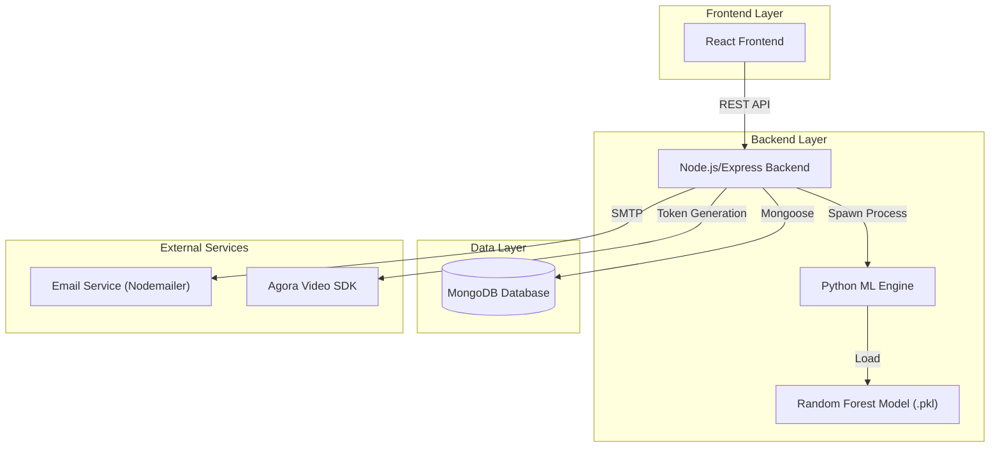
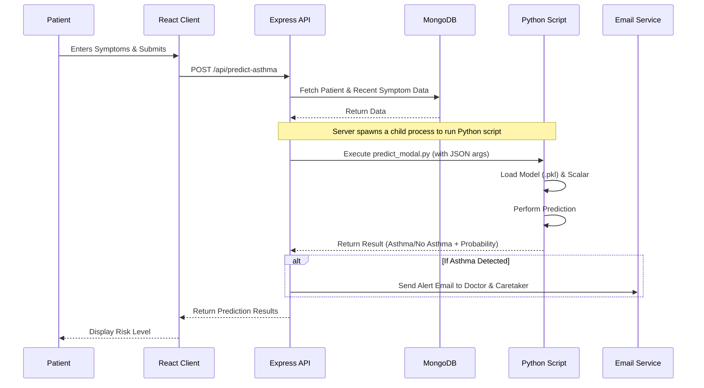

# Asthma Care Web Application

This repository contains a full-stack web application designed for comprehensive asthma management. It facilitates monitoring, prediction, and communication between patients, doctors, and caretakers.

The application leverages a machine learning model to predict asthma attacks based on patient symptoms and historical data, and integrates real-time video calling features for remote consultations.

## Features

- **Role-Based Access Control:** Distinct dashboards for Doctors, Patients, Caretakers, and Admins.
- **Asthma Prediction:** Uses a Random Forest Machine Learning model (Python) spawned by the Node.js backend to predict asthma risk based on symptoms.
- **Real-Time Video Consultation:** Integrated video calling feature using Agora SDK.
- **Medication Management:** Doctors can prescribe medication, and the system sends automated email reminders to patients.
- **Appointment Scheduling:** Patients can book appointments with doctors; reminders are sent automatically.
- **Symptom Tracking:** Patients can log daily symptoms which are used for health monitoring and ML predictions.
- **SOS Alerts:** Emergency alert system for critical situations.
- **Admin Panel:** Manage doctors, patients, and caretakers.

## Architecture

The project follows a modern Client-Server architecture with a specialized integration for Machine Learning.



## System Flow

### Asthma Prediction Flow

The core feature of the application is the intelligent asthma prediction system.



### Data Flow

Data flows securely between the client and server using JSON payloads.

- **Frontend:** Collects user input (forms) -> Validates -> Sends JSON via Axios.
- **Backend:** Express Routes receive JSON -> Controllers process data -> Mongoose Models interact with MongoDB.
- **ML Integration:** Backend serializes data to JSON string -> Passes as command-line argument to Python script -> Python script parses JSON -> Returns string output.

## Folder Structure

```
asthma_web/
├── client/                     # Frontend (React + Vite)
│   ├── public/
│   ├── src/
│   │   ├── assets/             # Images and styles
│   │   ├── components/         # Reusable UI Components
│   │   │   ├── Admin/          # Admin Dashboard & Management
│   │   │   ├── doctor/         # Doctor Dashboard & Features
│   │   │   ├── Patient/        # Patient Dashboard & Features
│   │   │   ├── caretaker/      # Caretaker Dashboard
│   │   │   ├── login/          # Authentication Pages
│   │   │   ├── register/       # Registration Pages
│   │   │   └── video/          # Video Call Components
│   │   ├── utils/              # Helper functions
│   │   ├── App.jsx             # Main Application Component & Routing
│   │   └── main.jsx            # Entry Point
│   ├── index.html
│   └── vite.config.js
│
└── server/                     # Backend (Node.js + Express)
    ├── controllers/            # Logic for handling API requests
    ├── data/                   # Seed data or static files
    ├── models/                 # Mongoose Schemas (User, Patient, Symptom, etc.)
    ├── routes/                 # API Route Definitions
    ├── services/               # Background services (Cron jobs, Email)
    ├── utils/                  # Utility functions (Email sender)
    ├── venv/                   # Python Virtual Environment
    ├── predict_modal.py        # Python script for ML Prediction
    ├── asthma_model_final_rf.pkl # Trained ML Model
    ├── scaler.pkl              # Data Scaler
    ├── label_encoders.pkl      # Label Encoders
    ├── server.js               # Entry Point
    └── package.json
```

## Getting Started

### Prerequisites

- **Node.js** (v14 or higher)
- **Python** (v3.8 or higher)
- **MongoDB** (Local or Atlas URL)
- **npm** or **yarn**

### Installation

1.  **Clone the repository:**
    ```bash
    git clone <repository-url>
    cd asthma_web
    ```

2.  **Setup the Backend:**
    ```bash
    cd server
    npm install
    ```
    
    **Database & Environment Configuration:**
    Create a `.env` file in the `server/` directory following the example provided in `.env.example`:
    ```env
    MONGO_URI=your_mongodb_connection_string
    JWT_SECRET=your_secret_key
    AGORA_APP_ID=your_agora_app_id
    AGORA_APP_CERTIFICATE=your_agora_certificate
    # Note: Email credentials for nodemailer are currently configured in utils/sendEmail.js
    ```

    **Python Environment Setup:**
    Ensure you have Python installed. It is recommended to create a virtual environment inside `server/` or install dependencies globally.
    ```bash
    # Install Python dependencies (from requirements.txt if available, or manually install pandas, scikit-learn, joblib)
    pip install pandas scikit-learn joblib
    ```

3.  **Setup the Frontend:**
    ```bash
    cd ../client
    npm install
    ```

### Running the Application

1.  **Start the Backend Server:**
    ```bash
    cd server
    node server.js
    # Server runs on http://localhost:5000
    ```

2.  **Start the Frontend:**
    ```bash
    cd client
    npm run dev
    # Client runs on http://localhost:5173 (default Vite port)
    ```

3.  **Access the App:**
    Open your browser and navigate to the frontend URL.

## Security Note

**Important per usage policy:** This repository does **not** contain any real secret keys or passwords.
- The `.env.example` file shows which keys are required.
- You must provide your own API keys for MongoDB, Agora, and Email services to run the application fully.
- **Do not commit your `.env` file or any file containing real credentials to GitHub.**

## License

This project is licensed under the MIT License.
